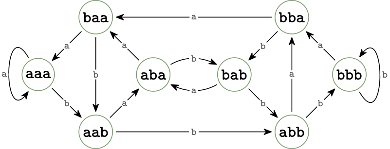

# :repeat: dBG_cycles: counting and enumerating simple cycles in the de Bruijn graph

`dBG_cycles` is a Rust library and a tool for counting and enumerating simple cycles in the (full) de Bruijn graph.



Under the hood, it relies on a bijection between those simple cycles and a restricted family of Lyndon words, that can be efficiently enumerated using Duval's algorithm. We hope it will help to further investigation on the cycle structure of de Bruijn graph. 

### :gear: Compiling the project 

Installing and compiling a Rust project requires Cargo (https://doc.rust-lang.org/cargo/getting-started/installation.html). 
Retrieving `dbg_cycles` is done by 

``` shell
# Building the release target
cargo build --release 
# Create a symlink at the root of the project
ln -s target/release/dbg_cycles .
```

### :keyboard: A simple command line interface 

Here are the commands available from the command line.

``` shell
# Enumerate all the simple cycles of length 7 in the de Bruijn graph of order 4 on a alphabet of size 4
./dbg_cycles enum --order 4 --length 7 --sigma 4
# Enumerate all the simple cycles in the de Bruijn graph of order 4 on a alphabet of size 2 (default alphabet size)
./dbg_cycles enum --order 4

# Count all the simple cycles of length 7 in the de Bruijn graph of order 4 on a alphabet of size 4
# Highlight whether it has been deduced from a direct formula or by an enumerate-then-count approach
./dbg_cycles count --order 3 --length 5
# Count all the simple cycles in the de Bruijn graph of order 4 on a alphabet of size 2
./dbg_cycles count --order 3

# Bring our conjecture in face of the enumerate-then-count approach. 
# Couples of parameters that are less computationally demandant are traversed (roughly) first
./dbg_cycles conjecture
```

You can further take advantage of this library by looking directly at the source code :eyes:.
